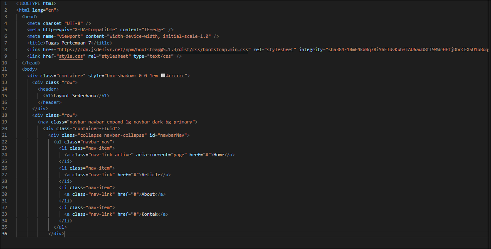
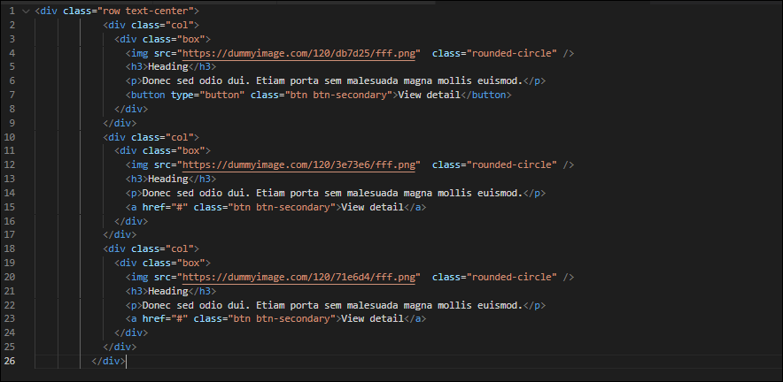
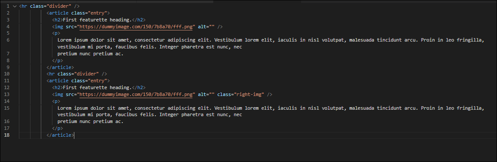
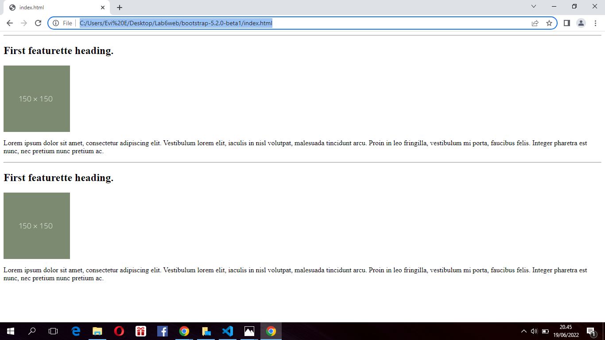
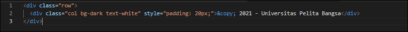

# Lab5web

Nama    : Aka erlanda

Nim     : 312010207

Kelas   : TI.20.B.1

# Pratikum 5 Pemgrograman web

# soal

Buatlah Sebuah Layout sederhana seperti pada tugas praktikum 4. Tetapi dengan menggunakan css framework (twitter bootstrap).

<b>Membuat Header , Hero , dan Navigation menu</b>

Disini saya tidak mengunduh file bootsrap nya melainkan saya membuat layout dengan menggunakan bootstrap cdn dimana penggunaan nya harus menggunakan koneksi internet atau online. Dan ssaya juga disini masih menggunakan css eksternal untuk modified nya.

<b>Berikut Source code pembuatan header, nav, dan section hero di file index.html :</b>

jika dilihat hasilnya akan seperti berikut :

<b>Membuat 2 kolom, 1 kolom Heading dan 1 kolom buat Widget Header</b>

Disini saya akan membuat 2 kolom , kolom sisi kiri untuk Heading dan kolom sisi kanan untuk widget Header.

Berikut source code yang saya buat :

Maka hasilnya akan seperti ini :

Pada bagian ini saya menambahkan article content masih di kolom kiri menambahkannya dibawah main content yg pertama tadi . Untuk source code nya seprti berikut :

Maka hasil nya seperti berikut di bawah ini :

<b>Membuat widget menggunakan list group</b>

Untuk selanjutnya saya akan membuat widget. Berikut source codenya :

Maka hasil nya seperti berikut :

<b>Membuat Footer</b>
Source code nya seperti berikut :

Dan Hasilnya akan seperti berikut :

# terimah kasih

